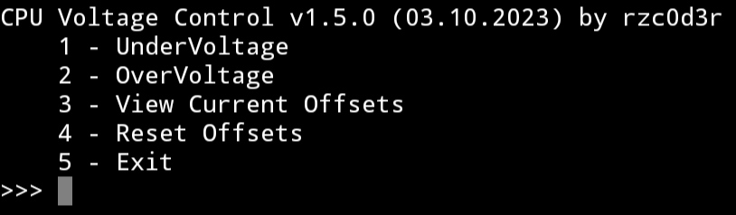
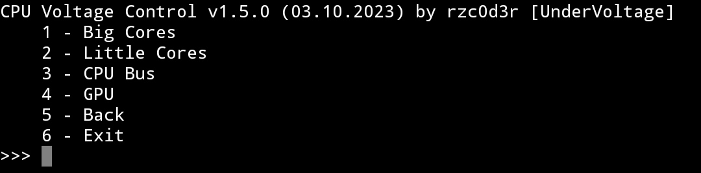
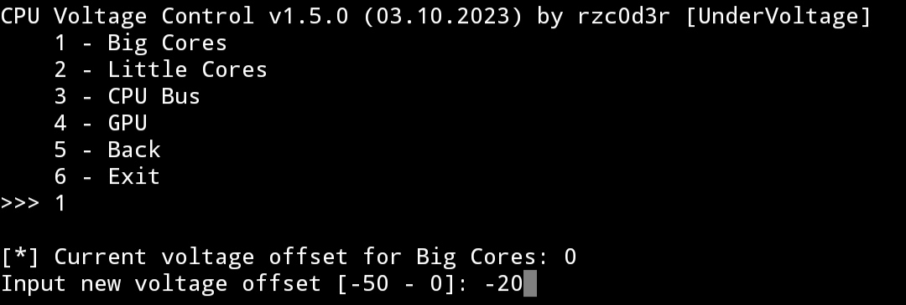
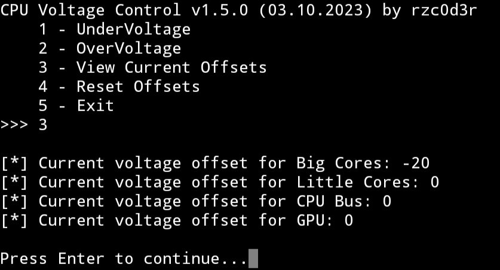
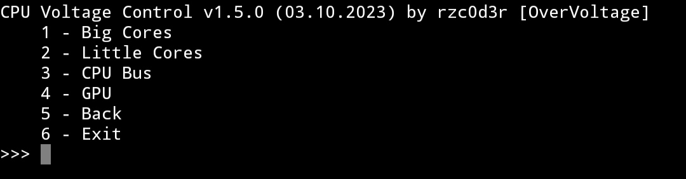
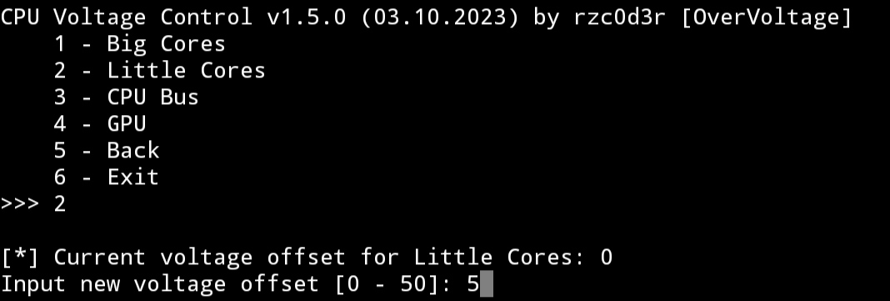
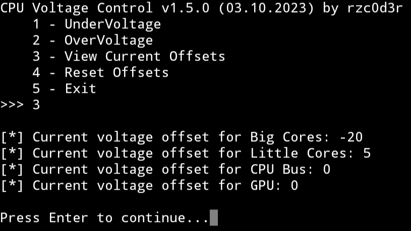
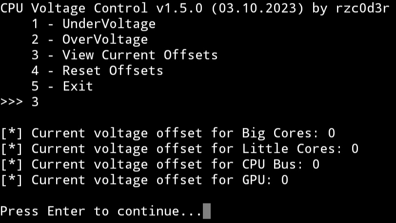

# CPU Voltage Control

Tool for Android smartphones to control the CPU voltage from mediatek (Under/Over volting)

# How to use

1. You need a rooted device!

2. Install [Pydroid3 IDE](https://play.google.com/store/apps/details?id=ru.iiec.pydroid3), [Pydroid3 Permissions Plugin](https://play.google.com/store/apps/details?id=ru.iiec.pydroidpermissionsplugin)

3. Open the Pydroid3 IDE configure it, then open my project file and run it. You will need to allow access to root in your root manager. 

4. Done! Now navigate through the menu by entering numbers using the prompts in the console

# Screenshots

### Main Menu

### Undervoltage Menu

### Overvoltage Menu

### Reset Function

# Recommendations and information

1. Successfully tested on processors: mt6769t (Helio G80), mt6769z (Helio G85)

2. If you specify low values, the phone may freeze completely. Just do an emergency reboot.

3. I do not recommend the use of higher voltage of course if you do not want to kill the phone :)
